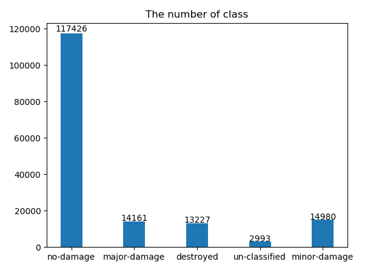
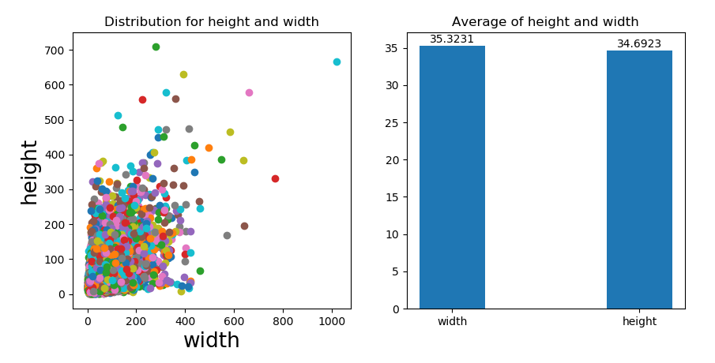
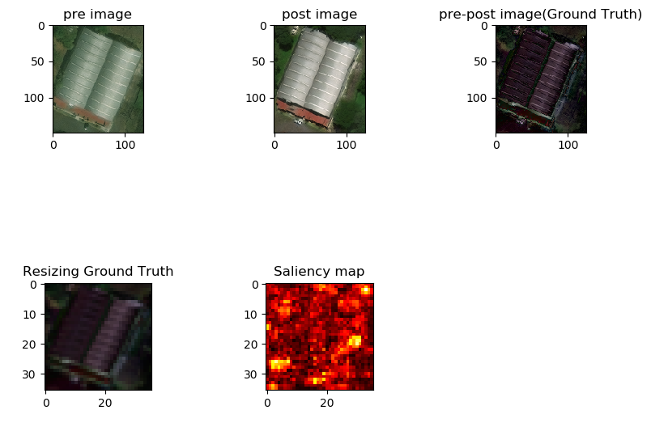
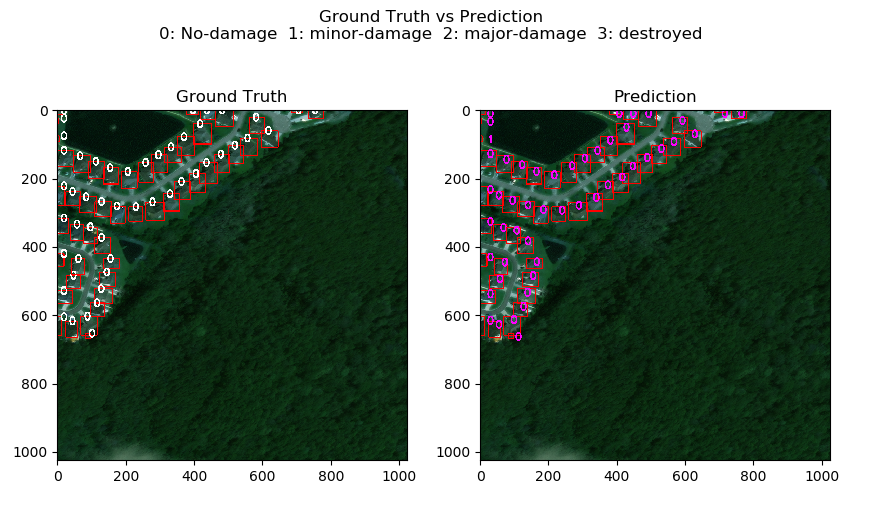
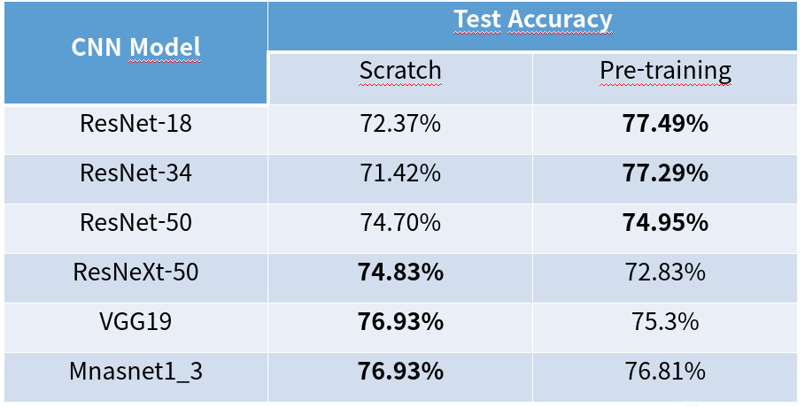

# Deep-learning-project
Check damaged house with subtract between pre image and post image at disaster situation

## 0. Quick start

 * a. [download][https://gisto365-my.sharepoint.com/:f:/g/personal/jhdf1234_gm_gist_ac_kr/ElToUUS-rjJNujoKDj0LPqQBWaKCBFpMCvrWK9ceMDojnA?e=2MkbE3] 
 * b. test_module.py 실행

 학습된 resnet18로 이미지에 대해 테스트 가능하다.
## 1. Dataset
[Xview2][https://xview2.org/]

 * Dataset : 3600장
	train dataset : 2700장
		--> 전처리 후 162786 이미지
	test dataset : 900장
		--> 전처리 후 54862 이미지

## 2. Preprocessing 
위의 데이터 셋을 다운로드하면 폴더가 image와 label로 나눠져 있습니다. 따라서, 학습을 위해서는 밑의 new folder 모양처럼 바꿔야 합니다.

*  폴더 나누기 
  mk_Sum_folder.py 실행하기
  단, original, new 변수 바꾸기(train, test)

  * <original folder 모양>
    original ----- images ----- 1_pre.jpg 1_post.jpg 2_pre.jpg 2_post.jpg ...
            |
            |
             ----- labels ----- 1_pre.json 1_post.json 2_pre.json 2_post.json ...
    
  * <New folder 모양>
    New  ----- ex1 ----- ex1_pre.jpg ex1_pre.json ex1_post.jpg ex1_post.json 
        |
        |
         ----- ex2 ----- ex2_pre.jpg ex2_pre.json ex2_post.jpg ex2_post.json
        |
        |
         ----- ex3 ----- ex3_pre.jpg ex3_pre.json ex3_post.jpg ex3_post.json
         .
         .
         .
        All dataset

## 3. Training

학습은 밑의 하이퍼파라미터가 default로 되어있습니다. 만약, 원하는 하이퍼 파라미터가 있다면 바꿔서 진행해야합니다. 또한, train/test dataset은 'data/pre_train'과 'data/pre_test'와 같은 형태로 폴더에 들어가 있어야 합니다.

Learning rate(learning_rate) : 0.001​

Epoch(Epoch_num) : 50​

Batch size(Batch_size) : 1024​

Resolution(Resolution) : 36x36​

Optimizer(optimizer) : Adam​

Loss function(criterion) : Cross-Entropy-Loss

## 4. Result
밑의 script로 각각에 해당하는 결과를 볼 수 있습니다.
* a. Check_dataset.py
	* class 당 비율
	
	
	* 높이와 너비 분포 및 평균
	

* b. test_module.py
	* pre-image/post-image 비교 및 salience map.
	
	
	* Ground truth vs Prediction
	
	
* c. 전체 모델 정확도 테스트 결과
	

